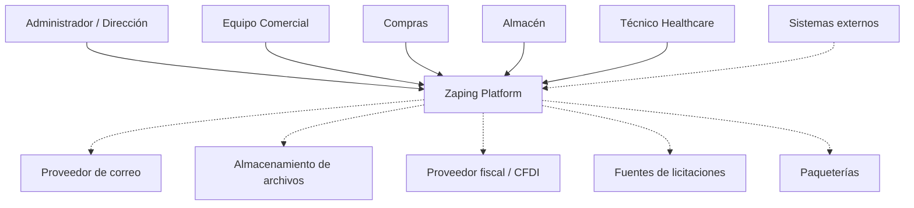

# C1 — System Context

**Sistema:** Zaping Platform
**Nivel C4:** 1 — System Context
**Versión:** 2.0.0
**Estado:** Aprobado
**Última actualización:** 2026-08-19

---

# 1. Propósito

Este documento representa el contexto general de Zaping.

El objetivo del nivel C1 es mostrar:

* quién utiliza Zaping;
* qué responsabilidades generales tiene la plataforma;
* qué sistemas externos pueden relacionarse con ella;
* y dónde se encuentra el límite del sistema.

No describe módulos internos ni tecnologías específicas.

---

# 2. Sistema principal

## Zaping Platform

Plataforma empresarial SaaS multiempresa orientada a administrar operaciones comerciales y logísticas.

Incluye conceptualmente:

* Zaping ERP Core;
* Zaping Healthcare;
* Zaping Radar;
* futuras capacidades de Business Intelligence;
* futuras capacidades de Zaping AI.

---

# 3. Usuarios

## Administrador / Dirección

Utiliza Zaping para:

* administrar la empresa;
* consultar indicadores;
* gestionar usuarios;
* controlar permisos;
* revisar actividad;
* supervisar operaciones.

---

## Equipo Comercial

Utiliza Zaping para:

* clientes;
* oportunidades;
* cotizaciones;
* pedidos;
* ventas;
* seguimiento comercial.

---

## Compras

Utiliza Zaping para:

* proveedores;
* órdenes de compra;
* seguimiento de abastecimiento;
* cantidades pendientes.

---

## Almacén

Utiliza Zaping para:

* recepciones;
* inventario;
* lotes;
* caducidades;
* preparación;
* entregas;
* devoluciones;
* Case Logistics.

---

## Técnico Healthcare

Utilizará Zaping Healthcare para:

* Cases;
* calendario;
* material asignado;
* equipo;
* custodia;
* retornos;
* conciliación.

---

# 4. Sistemas externos

Las integraciones se distinguen entre actuales y futuras.

## Proveedores de correo

**Estado:** integración según necesidades del producto.

Pueden utilizarse para:

* recuperación de contraseña;
* notificaciones;
* documentos;
* alertas.

---

## Almacenamiento de archivos

**Estado:** capacidad futura / según implementación.

Puede utilizarse para:

* documentos;
* PDFs;
* archivos adjuntos;
* evidencias;
* recursos empresariales.

---

## Servicios fiscales / CFDI

**Estado:** futuro.

Zaping podrá integrarse con proveedores fiscales para procesos relacionados con facturación electrónica en México.

Zaping ERP Core no depende actualmente de esta integración para funcionar.

---

## Fuentes de licitaciones

**Estado:** futuro — Zaping Radar.

Radar podrá consumir información proveniente de:

* portales públicos;
* fuentes gubernamentales;
* sistemas de contratación;
* otras fuentes autorizadas.

---

## Paqueterías y logística

**Estado:** futuro.

Pueden integrarse para:

* guías;
* seguimiento;
* entregas;
* estados de envío.

---

## Sistemas externos de clientes

**Estado:** futuro.

Podrán utilizar una Public API o integraciones controladas.

---

# 5. Diagrama



Las relaciones punteadas representan integraciones que pueden encontrarse planificadas, parciales o futuras y no deben interpretarse automáticamente como implementadas.

---

# 6. Límite del sistema

Dentro del límite de Zaping se encuentran las reglas empresariales relacionadas con:

* ERP;
* Healthcare;
* usuarios;
* seguridad;
* inventario;
* compras;
* ventas;
* trazabilidad;
* coordinación operacional.

Fuera del límite se encuentran servicios independientes como:

* SAT/proveedores fiscales;
* proveedores de correo;
* almacenamiento cloud externo;
* paqueterías;
* portales gubernamentales;
* sistemas de terceros.

---

# 7. Multi-tenancy

Todos los usuarios empresariales trabajan dentro del contexto de una Company.

Conceptualmente:

```text
Zaping Platform
│
├── Company A
├── Company B
└── Company C
```

La plataforma compartida no implica datos compartidos.

Cada tenant debe permanecer aislado.

---

# 8. Canales futuros

Zaping podrá ser utilizado mediante diferentes canales:

```text
Web App
Customer Portal
Mobile App
Public API
Integrations
```

Actualmente la aplicación web constituye el canal principal.

Los demás representan arquitectura objetivo o futura.

---

# 9. Responsabilidad de Zaping

Zaping es responsable de:

* mantener información empresarial;
* ejecutar reglas de negocio;
* mantener trazabilidad;
* controlar autorización;
* aislar tenants;
* coordinar workflows;
* exponer APIs controladas.

---

# 10. Fuera del alcance de Zaping

Zaping no pretende inicialmente convertirse en:

* sistema bancario;
* sistema clínico hospitalario;
* expediente médico electrónico;
* motor fiscal propio;
* infraestructura de correo;
* proveedor de almacenamiento cloud;
* proveedor de paquetería.

Estas capacidades se consumen mediante integraciones cuando sea necesario.

---

# 11. Principio final

C1 representa:

```text
Personas
+
Zaping
+
Sistemas externos
```

No debe utilizarse para describir clases, módulos o tablas.

Es la vista más amplia de la arquitectura.
