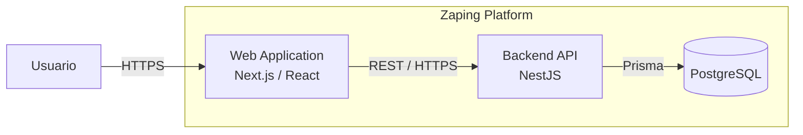
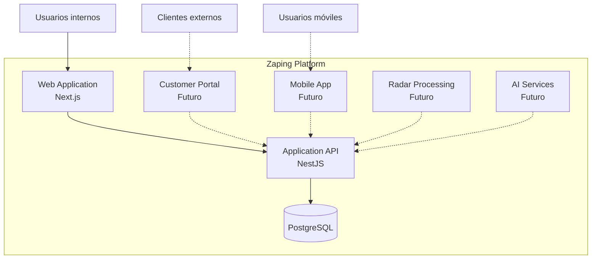

# C2 — Containers

**Sistema:** Zaping Platform
**Nivel C4:** 2 — Containers
**Versión:** 2.0.0
**Estado:** Aprobado
**Última actualización:** 2026-08-19

---

# 1. Propósito

Este documento representa los principales contenedores ejecutables o de almacenamiento de Zaping.

El nivel C2 muestra:

* aplicaciones;
* servicios;
* bases de datos;
* canales principales;
* comunicación entre ellos.

No representa módulos internos del backend.

---

# 2. Arquitectura actual

La plataforma utiliza actualmente:

```text
Web Browser
    ↓
Next.js Web Application
    ↓
NestJS REST API
    ↓
Prisma ORM
    ↓
PostgreSQL
```

---

# 3. Web Application

## Tecnología

```text
Next.js
React
TypeScript
Tailwind CSS
```

## Responsabilidad

Proporciona la interfaz principal para usuarios empresariales.

Responsabilidades:

* navegación;
* páginas;
* formularios;
* tablas;
* workflows;
* feedback;
* consumo de API;
* representación de permisos.

No es la autoridad final para:

* autorización;
* multi-tenancy;
* reglas críticas.

---

# 4. Backend API

## Tecnología

```text
NestJS
Node.js
TypeScript
```

## Responsabilidad

Contiene:

* API de aplicación;
* autenticación;
* autorización;
* reglas empresariales;
* coordinación de dominios;
* validaciones;
* transacciones;
* acceso controlado a persistencia.

El backend constituye la autoridad principal para las operaciones de negocio.

---

# 5. PostgreSQL

## Tecnología

```text
PostgreSQL
```

## Responsabilidad

Almacena la información persistente de la plataforma.

Incluye:

* datos empresariales;
* relaciones;
* inventario;
* documentos;
* usuarios;
* trazabilidad;
* auditoría cuando corresponda.

Los datos se mantienen aislados lógicamente por Company.

---

# 6. Prisma

Prisma es utilizado como ORM entre NestJS y PostgreSQL.

Conceptualmente:

```text
NestJS
↓
Prisma
↓
PostgreSQL
```

Prisma es una tecnología interna del Backend Container.

No constituye un contenedor independiente de despliegue.

---

# 7. Diagrama actual



---

# 8. Autenticación

El flujo principal es:

```text
Web Application
↓
Backend API
↓
Authentication
↓
JWT
↓
Authenticated Requests
```

Las credenciales y permisos son validados por backend.

---

# 9. Multi-tenancy

El Backend API determina el contexto de Company y aplica aislamiento antes de operar sobre PostgreSQL.

Conceptualmente:

```text
Request
↓
JWT
↓
User
↓
companyId
↓
Business Operation
↓
Tenant-Aware Persistence
```

---

# 10. APIs

La Web Application consume actualmente una REST Application API.

Esto permite que posteriormente otros clientes utilicen los mismos casos de uso.

---

# 11. Contenedores futuros

La arquitectura contempla posibles nuevos consumidores o servicios.

No deben interpretarse como implementados actualmente.

---

## Customer Portal

**Estado:** Futuro.

Aplicación destinada a usuarios externos autorizados.

Podrá permitir:

* consultar cotizaciones;
* pedidos;
* facturas;
* documentos;
* estado de operaciones.

---

## Mobile Application

**Estado:** Futuro.

Aplicación orientada especialmente a:

* vendedores;
* técnicos;
* operaciones de campo.

Debe reutilizar APIs del backend siempre que sea apropiado.

---

## Zaping Radar Processing

**Estado:** Futuro.

Radar puede requerir procesos separados para:

* conectores;
* jobs;
* ingesta;
* normalización;
* alertas.

Su separación física se decidirá cuando exista necesidad técnica.

---

## AI Services

**Estado:** Futuro.

Las cargas de AI pueden requerir infraestructura independiente.

No forman parte del backend operacional crítico.

---

# 12. Vista objetivo



---

# 13. Sistemas externos

Sistemas como:

* correo;
* almacenamiento;
* CFDI;
* paqueterías;
* portales de contratación;

se consideran sistemas externos, no contenedores internos de Zaping salvo que en el futuro se implemente infraestructura propia.

---

# 14. Despliegue

Actualmente la arquitectura lógica permite despliegues separados para:

```text
Frontend
Backend
Database
```

La topología productiva concreta se definirá antes del despliegue correspondiente.

---

# 15. Escalamiento

El Backend Container podrá escalar horizontalmente cuando exista infraestructura que lo requiera.

Conceptualmente:

```text
Load Balancer
│
├── Backend 1
├── Backend 2
└── Backend 3
```

No es necesario dividir módulos en microservicios para lograr este tipo de escalamiento.

---

# 16. Seguridad de comunicación

En producción:

```text
User
→ HTTPS
→ Web

Web
→ HTTPS
→ API
```

Las credenciales de base de datos no deben estar disponibles en frontend.

---

# 17. Responsabilidades por contenedor

| Container        | Responsabilidad             |
| ---------------- | --------------------------- |
| Web Application  | experiencia de usuario      |
| Backend API      | reglas y coordinación       |
| PostgreSQL       | persistencia                |
| Customer Portal  | futuro canal externo        |
| Mobile App       | futuro canal móvil          |
| Radar Processing | futura inteligencia externa |
| AI Services      | futura inteligencia         |

---

# 18. Principio final

Los Containers representan unidades de ejecución y almacenamiento.

El nivel C2 no debe convertirse en una lista de módulos NestJS.

Los módulos internos pertenecen al nivel C3.
