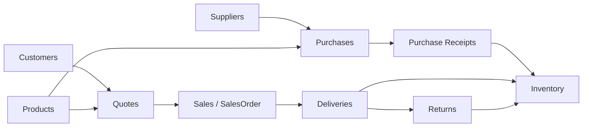
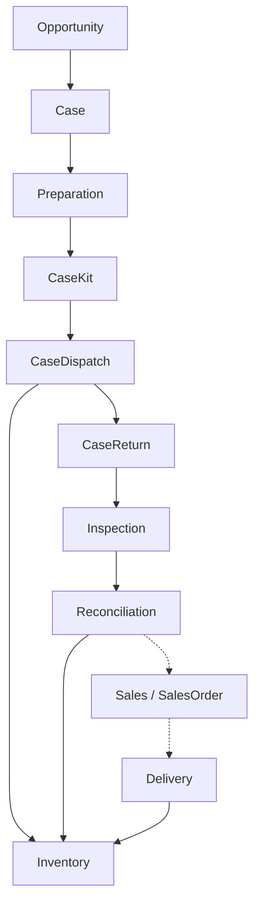

# C3 — Components

**Sistema:** Zaping Platform
**Container principal:** Backend API
**Nivel C4:** 3 — Components
**Versión:** 2.0.0
**Estado:** Aprobado
**Última actualización:** 2026-08-19

---

# 1. Propósito

Este documento describe los principales componentes internos de los Containers de Zaping.

El foco principal es el Backend API porque concentra las reglas empresariales.

También se representa la organización conceptual del frontend.

---

# 2. Backend API

El Backend API utiliza un Modular Monolith.

Conceptualmente:

```text
NestJS Backend
│
├── Platform / Identity
├── ERP Core
├── Healthcare
├── Read / Coordination
└── Infrastructure
```

No todos los componentes objetivo se encuentran implementados actualmente.

---

# 3. Platform / Identity

Incluye capacidades transversales.

## Auth

Responsable de:

* login;
* registro cuando corresponda;
* JWT;
* recuperación de contraseña;
* contexto autenticado.

---

## Companies

Responsable del tenant empresarial.

---

## Users

Responsable de:

* usuarios;
* estado;
* asociación con Company.

---

## Authorization

Responsable de:

* roles;
* Guards;
* permisos;
* enforcement de acceso.

La implementación granular continúa en evolución.

---

# 4. ERP Core

Los principales componentes de dominio son:

```text
Customers
Suppliers
Products
Inventory
Purchases
Purchase Receipts
Quotes
Sales
Deliveries
Returns
```

El estado individual de implementación debe consultarse en `PROJECT_BOARD.md`.

---

# 5. Customers

Responsable del ciclo de vida de clientes.

No es responsable de:

* inventario;
* billing;
* Cases.

---

# 6. Suppliers

Responsable del catálogo y relaciones de proveedores.

Purchases consume Supplier como participante del proceso de abastecimiento.

---

# 7. Products

Responsable del catálogo de productos.

Puede contener información como:

* SKU;
* descripción;
* categoría;
* precio;
* costo;
* trazabilidad requerida.

No debe ser propietario de la historia de inventario.

---

# 8. Purchases

Responsable de:

* Purchase;
* Purchase Items;
* ciclo de abastecimiento;
* proveedor;
* cantidades ordenadas;
* costos.

### Invariante

```text
Purchase
≠
Inventory IN
```

---

# 9. Purchase Receipts

Responsable del evento de recepción física asociado a Purchases.

Conceptualmente:

```text
Purchase
↓
PurchaseReceipt
↓
Inventory
```

Puede soportar:

* recepción parcial;
* múltiples recepciones;
* lotes;
* caducidades;
* series.

---

# 10. Inventory

Responsable de:

* existencias;
* movimientos;
* lotes;
* series;
* disponibilidad;
* validación de cantidades;
* trazabilidad.

### Invariante

```text
Stock change
→
traceable inventory operation
```

Otros módulos no deben modificar stock directamente.

---

# 11. Quotes

Responsable de propuestas comerciales.

### Invariante

```text
Quote
≠
Inventory movement
```

---

# 12. Sales

Responsable del proceso comercial.

La arquitectura objetivo distingue:

```text
Quote
↓
SalesOrder
```

SalesOrder representa compromiso comercial.

---

# 13. Deliveries

Componente objetivo responsable del cumplimiento físico definitivo.

```text
SalesOrder
↓
Delivery
↓
Inventory OUT
```

### Estado

Arquitectura objetivo según ADR-011.

La implementación actual puede continuar utilizando temporalmente el modelo legacy de `Sale`.

---

# 14. Returns

Responsable de devoluciones vinculadas a operaciones físicas anteriores.

Debe preservar trazabilidad.

No debe modificar stock mediante incrementos arbitrarios.

---

# 15. Healthcare

Healthcare se mantiene separado del ERP Core.

Componentes objetivo:

```text
Healthcare
│
├── Opportunities
├── Cases
├── Case Calendar
├── Case Preparation
├── Kit Templates
├── Case Kits
├── Case Dispatch
├── Case Return
├── Inspection
├── Reconciliation
└── Equipment
```

Estos componentes representan arquitectura objetivo y deben implementarse progresivamente.

---

# 16. Cases

Responsable del contexto operacional de un procedimiento Healthcare.

Puede relacionar:

* técnico;
* médico;
* hospital;
* horario;
* recursos;
* oportunidades;
* operación comercial.

---

# 17. Case Calendar

Read model / vista de Cases programados.

No es propietario de las fechas.

```text
Case
→ scheduledStart / scheduledEnd
→ Calendar
```

---

# 18. Case Preparation

Coordina los recursos requeridos antes del procedimiento.

Consulta Inventory, pero no modifica arbitrariamente sus balances.

---

# 19. Case Kits

Representa material y equipo realmente preparado para un Case.

`KitTemplate` define una configuración reutilizable.

`CaseKit` representa una instancia real.

---

# 20. Case Dispatch

Representa salida temporal hacia custodia.

```text
Warehouse
↓
Technician / Case Custody
```

### Invariante

```text
CaseDispatch
≠
Definitive Inventory OUT
```

---

# 21. Case Return

Representa el retorno posterior a la operación.

Debe referenciar la salida original.

---

# 22. Inspection

Determina la condición del material o equipo retornado antes de considerarlo nuevamente disponible.

---

# 23. Reconciliation

Determina el destino final de lo enviado.

```text
Dispatched
=
Used
+
Returned
+
Unresolved
```

Puede posteriormente originar:

* Inventory disposition;
* Sales operation;
* Incident.

---

# 24. Equipment

Componente objetivo para activos reutilizables.

Debe mantener:

* identidad individual;
* serie;
* estado;
* custodia;
* Case;
* condición;
* historial.

---

# 25. Dashboard

Dashboard es un componente principalmente de lectura.

Consume información de varios dominios.

No debe ser propietario de reglas de:

* Customers;
* Inventory;
* Sales;
* Purchases.

---

# 26. Warehouse Operations

Es un Workspace / read model operacional.

Puede combinar:

```text
Purchase Receipts
Case Preparation
Case Dispatch
Case Returns
Deliveries
Returns
Incidents
```

No constituye automáticamente un nuevo dominio.

---

# 27. Audit

Responsable de registrar acciones empresariales relevantes.

Debe distinguirse de logging técnico.

---

# 28. Prisma

Prisma constituye la principal capa técnica de persistencia.

Puede ser utilizado por diferentes módulos dentro del Modular Monolith.

Sin embargo:

```text
Prisma access
≠
Domain ownership
```

---

# 29. Relaciones principales del ERP Core



Este diagrama representa dependencias conceptuales, no llamadas directas a tablas.

---

# 30. Flujo de abastecimiento

```text
Supplier
↓
Purchase
↓
Purchase Receipt
↓
Inventory IN
```

---

# 31. Flujo comercial objetivo

```text
Customer
↓
Quote (opcional)
↓
SalesOrder
↓
Delivery
↓
Inventory OUT
```

---

# 32. Healthcare + ERP Core



Las relaciones punteadas representan operaciones que dependen de resultado comercial y no necesariamente ocurren en todos los Cases.

---

# 33. Contratos entre dominios

Los módulos deben utilizar contratos explícitos.

Conceptualmente:

```text
PurchaseReceipts
↓
InventoryService

Deliveries
↓
InventoryService

Healthcare
↓
InventoryService

Healthcare
↓
SalesService
```

Los nombres concretos de Services pueden evolucionar.

El principio importante es la propiedad del dominio.

---

# 34. Dependencias prohibidas

Debe evitarse:

```text
Healthcare
↓
prisma.product.update({
  stock: ...
})
```

o:

```text
Sales
↓
modifica InventoryBatch directamente
```

si estas operaciones evitan reglas de Inventory.

---

# 35. Transacciones

Cuando una operación atraviese componentes dentro del mismo proceso, el Modular Monolith permite transacciones locales.

Ejemplo:

```text
PurchaseReceipt
+
InventoryBatch
+
InventoryMovement
+
Stock
```

---

# 36. Domain Events

Cuando una dependencia síncrona cree acoplamiento innecesario puede evaluarse un evento.

Ejemplo:

```text
PurchaseReceived
```

Pero no debe utilizarse un evento únicamente para aparentar desacoplamiento.

---

# 37. Frontend Components

La arquitectura frontend sigue:

```text
App Router / Pages
↓
Feature Workflows
↓
Business Components
↓
UI Components
```

---

# 38. App Router / Pages

Responsable de:

* rutas;
* layouts;
* composición.

---

# 39. Feature Workflows

Ejemplos:

```text
Purchase Form
Purchase Receipt Form
Sales Order Detail
Delivery Flow
Case Preparation
```

Contienen lógica de interacción específica.

---

# 40. Business Components

Ejemplos:

```text
ProductSelector
SupplierSelector
CustomerSelector
StatusBadge
MoneyInput
```

---

# 41. UI Components

Ejemplos:

```text
Button
Table
Modal
Input
Badge
ConfirmDialog
LoadingSpinner
```

Permanecen independientes del negocio.

---

# 42. API Client

La Web Application debe utilizar una capa común para acceder al backend.

Conceptualmente:

```text
Feature
↓
API Client
↓
REST API
```

Evitar llamadas HTTP dispersas sin un patrón común.

---

# 43. Estado actual vs objetivo

Este documento utiliza:

## CURRENT

Existe en la implementación actual.

## TARGET

Está arquitectónicamente aprobado pero requiere implementación o refactor.

## FUTURE

Posibilidad todavía no comprometida.

---

# 44. Componentes CURRENT principales

Según el estado consolidado del proyecto, el Core ya contiene capacidades relacionadas con:

```text
Auth
Companies
Customers
Suppliers
Products
Inventory
Purchases
Purchase Receipts
Quotes
Sales
Dashboard
```

Returns y otros componentes deben verificarse mediante `PROJECT_BOARD.md` para conocer su estado operativo exacto.

---

# 45. Componentes TARGET principales

```text
SalesOrder
Delivery
Healthcare
Case Logistics
Equipment
Granular Permissions
Advanced Inventory Availability
```

---

# 46. Componentes FUTURE

```text
Billing / CFDI
Customer Portal
Mobile App
Public API
Radar Processing
AI Services
Advanced BI
```

Las prioridades concretas pertenecen a `ROADMAP.md`.

---

# 47. Regla de actualización

Este C3 debe cambiar cuando:

* aparezca un nuevo dominio significativo;
* se modifique una frontera importante;
* un componente cambie de responsabilidad.

No debe modificarse por cada Controller o archivo nuevo.

---

# 48. ADR relacionados

Principalmente:

```text
ADR-001 Multi-Tenant
ADR-002 Inventory Movements
ADR-005 Layered Architecture
ADR-006 API First
ADR-007 RBAC
ADR-009 Modular Monolith
ADR-011 SalesOrder / Delivery
ADR-012 Entity Lifecycle
ADR-013 Inventory Custody / Case Logistics
```

---

# 49. Principio final

El nivel C3 debe responder:

> ¿Qué componentes importantes existen dentro de Zaping y quién es responsable de cada comportamiento?

No debe intentar documentar cada clase.

Ese detalle pertenece al código y a la documentación específica de módulos.
